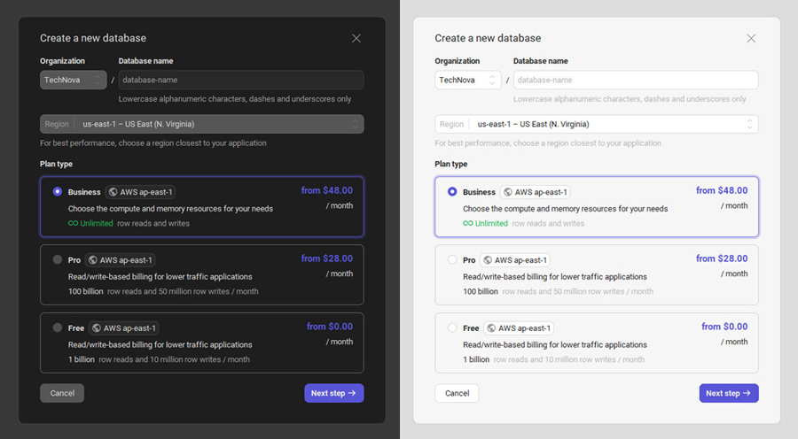
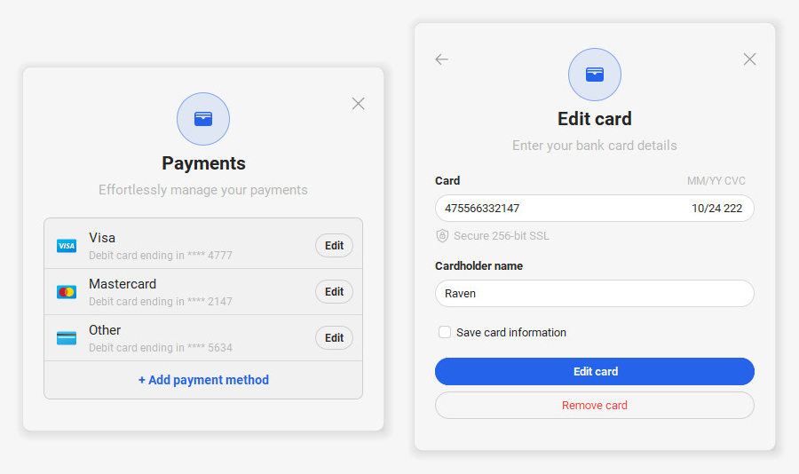

# FlatLaf Sample UI Design

Sample project build using java swing with flatlaf and miglayout.

### Sample Payment Form

### Database Plan Form

### Login Form

### Login Register Form

### Payment Method Form

## Library Resources
- [FlatLaf](https://github.com/JFormDesigner/FlatLaf) - FlatLaf library for the modern UI design theme
- [MigLayout](https://github.com/mikaelgrev/miglayout) - MigLayout library for flexible layout management
- [Modal Dialog](https://github.com/DJ-Raven/swing-modal-dialog) - Modal Dialog library for create modal popup dialog
- [Datetime Picker](https://github.com/DJ-Raven/swing-datetime-picker) - Datetime Picker library for create datetime picker

## UI Designers
This project design from: https://dribbble.com/pixsellz
